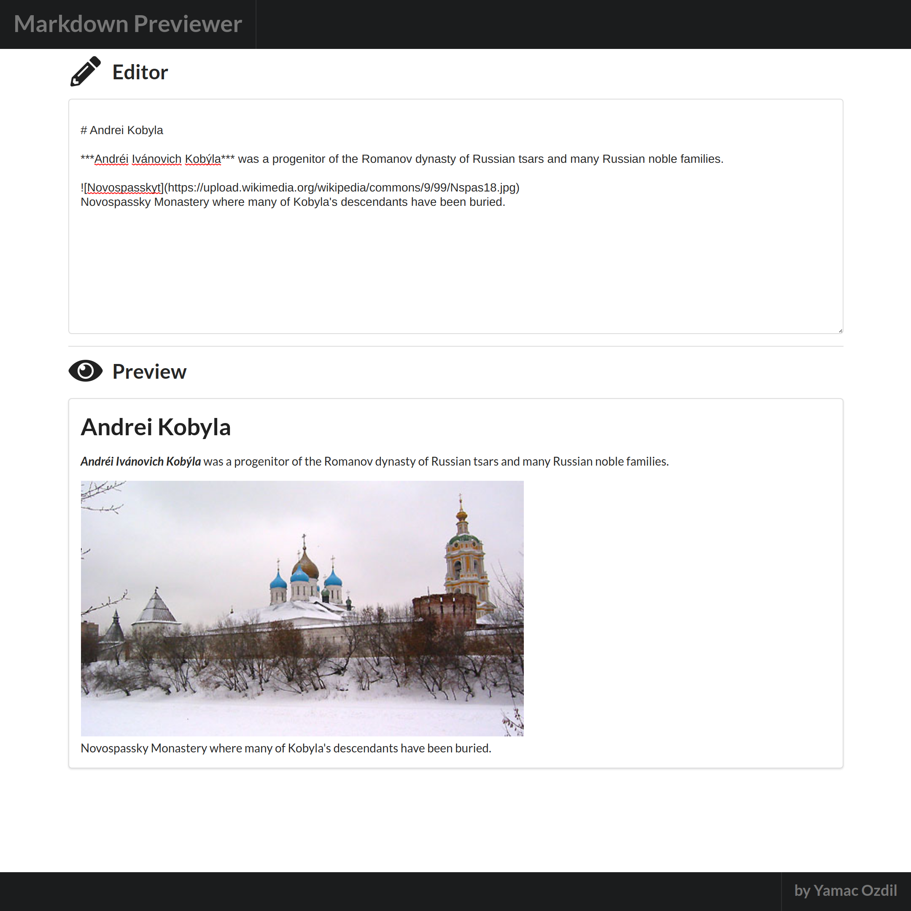

# Markdown Previewer

## Author
[Yamac Ozdil](https://github.com/yozdil)

## About

[MarkdownPreviewer](https://csb-wfx43.netlify.app/) was done for Front End Development Libraries Certification at [freeCodeCamp](https://www.freecodecamp.org). At it's core it uses React and Semantic UI for simple visuals and mobile responsiveness. Marked.js is used for markdown parsing and compiling.

## Setup

1. Install dependencies with `npm install`.
2. Right after `npm start` and write some markdown, see the results live!